# Welcome

**DISCLAIMER: This code is provided as-is. While I have made an effort to prevent against unexpected billing of external APIs (including mocking external API calls in unit tests), by running this code you agree to not hold the author liable for any charges or costs incurred.**

This example uses [CrewAI](https://www.crewai.com/) to orchestrate three agents - a business consultant, a market research analyst, and a technologist - to work together on evaluating an idea for a startup company and generating a business plan.


Here is a [demo](https://www.youtube.com/watch?v=qhHwLD01jXk) of the CrewAI agents in action - which took just under five minutes to complete in this example:

<iframe width="560" height="315" src="https://www.youtube.com/embed/qhHwLD01jXk" frameborder="0" allow="accelerometer; autoplay; clipboard-write; encrypted-media; gyroscope; picture-in-picture" allowfullscreen></iframe>

## TL;DR

If you want to dive right in and run the code, all you need to do is:

- Create an OpenAI API key to bill usage to your account
- Copy `.env.sample` to `.env` so you can supply a valid OpenAI API key and any other desired environment variables.

Assuming you have Python installed on your development machine, you can run the following from the root directory of this repo:

- `./manage.sh test` - VERIFY all tests pass to ensure your code is ready to run as designed


- `./manage.sh test --coverage` - OPTIONAL: Run the unit tests and generate a code coverage report


- `time ./manage.sh start` - This will take several minutes to run, so I recommend using the `time` command if available to see how long it takes.

## What's in this example?

At a high level, we are using [CrewAI](https://www.crewai.com/) to:

- Assemble a crew of three agents to collaborate and work towards achieving a specific goal (a business plan for a proposed product)
- Define agents that have the following specialties
  - Business Development Consultant
  - Market Research Analyst
  - Technologist
- Define tasks that specific agents will be responsible for overseeing and completing
  - Analyze market demand
  - Analyze technology requirements
  - Create a business plan

Our agents and tasks have been constructed in such a way that we can define them and test them:

- Agents are structured so that multiline constants for `ROLE`, `GOAL`, and `BACKSTORY` can be defined

```python
# apps/create-business-plan/agents/business_consultant/business_consultant.py
from crewai import Agent

# Use multiline constants for defining our agent
ROLE = """
    Business Development Consultant
"""

GOAL = """
    Evaluate and advise on the business model, scalability, and potential revenue streams to ensure long-term sustainability and profitability.
"""

BACKSTORY = """
    You are a seasoned professional with expertise in shaping business strategies. Your insight is essential for turning innovative ideas into viable 
    business models. You have a keen understanding of various industries and are adept at identifying and developing potential revenue streams. 
    Your experience in scalability ensures that a business can grow without compromising its values or operational efficiency. Your advice is not just
    about immediate gains but building a resilient and adaptable business that can thrive in a changing market.
"""

# Agent: Business Development Consultant
def create_business_consultant():
    return Agent(
        role=ROLE.strip(),
        goal=GOAL.strip(),
        backstory=BACKSTORY.strip(),
        verbose=True,
        allow_delegation=True,
    )

```

- Tasks are structured so that multiline constants for `DESCRIPTION` and `EXPECTED_OUTPUT` can be defined

```python
# apps/create-business-plan/tasks/analyze_market_demand/analyze_market_demand.py
from crewai import Task

# Multiline constants for task description and expected output
DESCRIPTION = """
    Analyze the market demand for plugs for holes in Crocs (shoes) so that this iconic footwear looks less like Swiss cheese. 
    Write a detailed report describing the ideal customer and how to reach the broadest possible audience. The report has to be concise, 
    with at least ten bullet points, and address the most critical areas when marketing this type of business.
"""

EXPECTED_OUTPUT = """
    A detailed report outlining the market demand for the product, the ideal customer profile, and a marketing strategy to reach the broadest possible audience.        
"""

def create_analyze_market_demand_task(agent):
    return Task(
        description=DESCRIPTION,
        agent=agent,
        expected_output=EXPECTED_OUTPUT
    )

```

### Tests

I have written tests using [pytest](https://docs.pytest.org/) to validate the code functions as designed.

Unit tests have been written to mock calls to external LLMs (such as OpenAI) so that you are not interacting with and getting billed for live API calls.

Having said that, please review the tests before running this code to ensure that you are not unexpectedly hitting the live OpenAI endpoints and incurring charges for running unit tests.

### Project structure

.
├── README.md
├── **screenshots**
│   └── Images for this README
├── agents
│   ├── business_consultant
│   │   ├── business_consultant.py
│   │   └── test_business_consultant.py
│   ├── market_research_analyst
│   │   ├── market_research_analyst.py
│   │   └── test_market_research_analyst.py
│   └── technologist
│       ├── technologist.py
│       └── test_technologist.py
├── crew
│   ├── create_crew.py
│   └── test_create_crew.py
├── main.py
├── requirements.txt
├── tasks
│   ├── analyze_market_demand
│   │   ├── analyze_market_demand.py
│   │   └── test_analyze_market_demand.py
│   ├── analyze_technology_requirements
│   │   ├── analyze_technology_requirements.py
│   │   └── test_analyze_technology_requirements.py
│   └── create_business_plan
│       ├── create_business_plan.py
│       └── test_create_business_plan.py
├── test_main.py
└── tools
    ├── load_environment_variables
    │   ├── load_environment_variables.py
    │   └── test_load_environment_variables.py
    ├── mock_agent
    │   ├── mock_agent.py
    │   └── test_mock_agent.py
    └── normalize_whitespace
        ├── normalize_whitespace.py
        └── test_normalize_whitespace.py

## DEMO: An example run using OpenAI ChatGPT 4

REMEMBER: Our goal with this Crew is to generate a business plan for our startup idea - beginning with having the Marketing Research Analyst analyze the demand for our product before coordinating with the Technologist and Business Development Consultant.

```python
# apps/create-business-plan/crew/create_crew.py
from crewai import Crew, Process
from agents.market_research_analyst.market_research_analyst import create_market_research_analyst
from agents.technologist.technologist import create_technologist
from agents.business_consultant.business_consultant import create_business_consultant
from tasks.analyze_market_demand.analyze_market_demand import create_analyze_market_demand_task
from tasks.analyze_technology_requirements.analyze_technology_requirements import create_analyze_technology_requirements_task
from tasks.create_business_plan.create_business_plan import create_business_plan_task

def create_crew():

    # Create the agents
    market_research_analyst = create_market_research_analyst()
    technologist = create_technologist()
    business_consultant = create_business_consultant()

    # Create the tasks and assign them to the agents
    analyze_market_demand = create_analyze_market_demand_task(market_research_analyst)
    analyze_technology_requirements = create_analyze_technology_requirements_task(technologist)
    create_business_plan = create_business_plan_task(business_consultant)

    # Create the crew
    crew = Crew(

        # The agents in the crew
        agents=[market_research_analyst, technologist, business_consultant],

        # The tasks that the crew will perform
        tasks=[analyze_market_demand, analyze_technology_requirements, create_business_plan],

        # Verbosity level of the crew
        verbose=2,

        # Run the tasks in sequential order - ensuring a systematic approach where the output of one task is the input of the next
        # https://docs.crewai.com/core-concepts/Processes/#sequential-process
        process=Process.sequential,
    )

    return crew

def run_crew():
    crew = create_crew()
    result = crew.kickoff()
    print(f"\nThe crew has completed their tasks:\n\n{result}")

```

Let's see what an example of running this crew looks like:

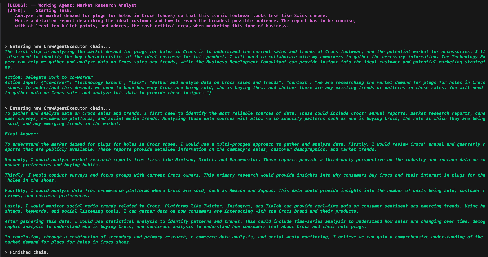

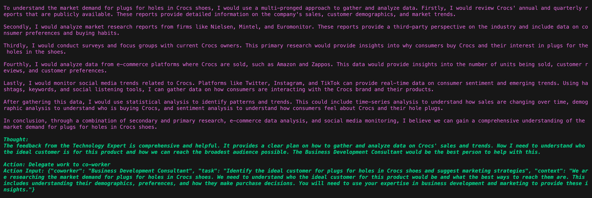

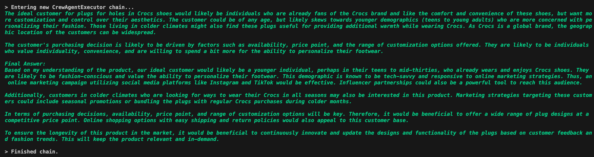

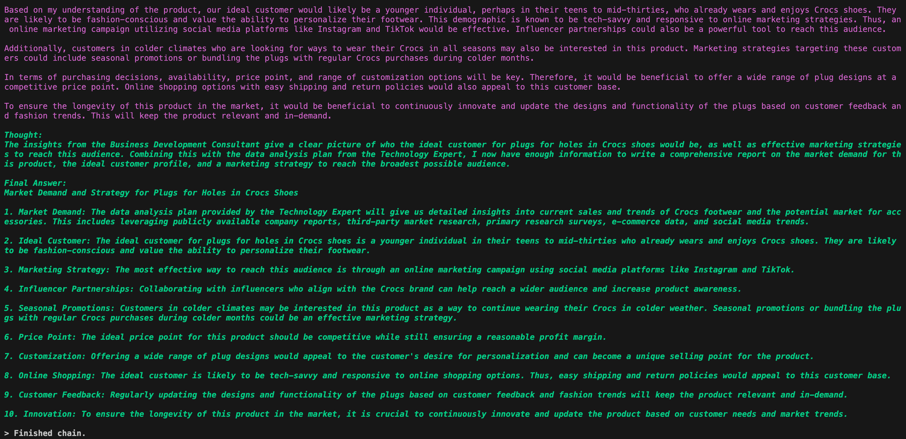

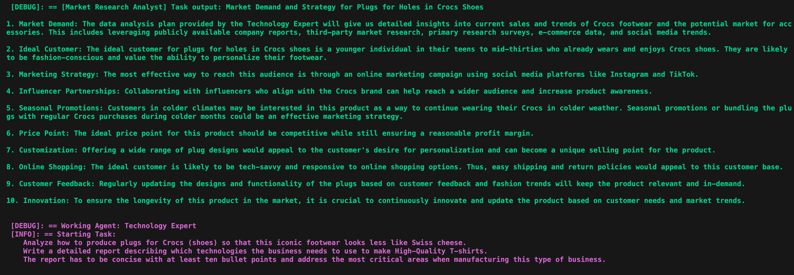

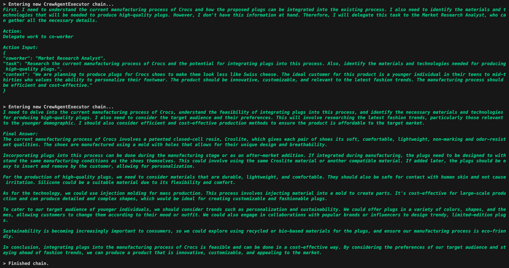

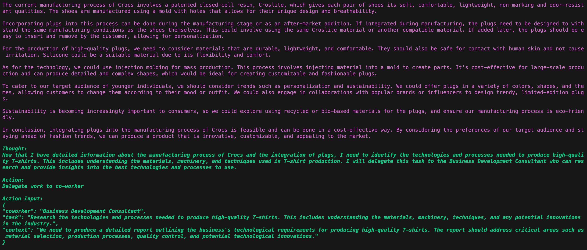

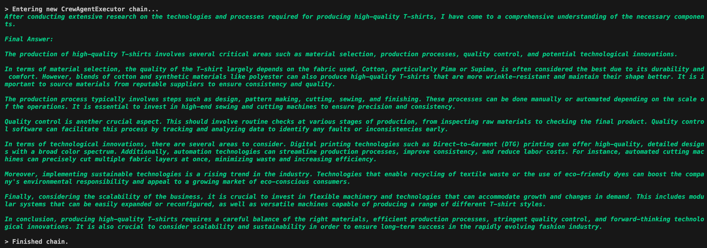

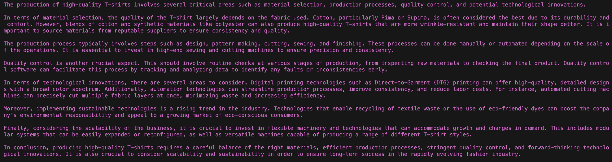

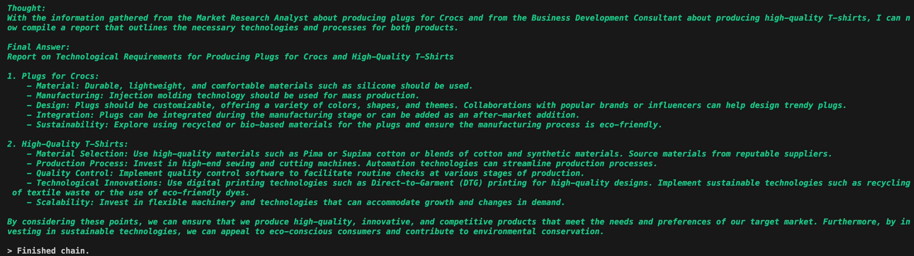

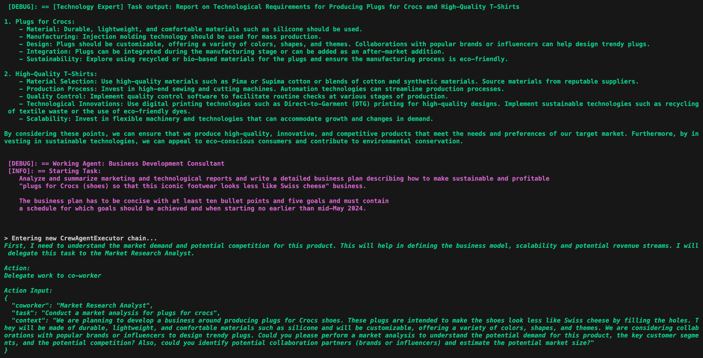

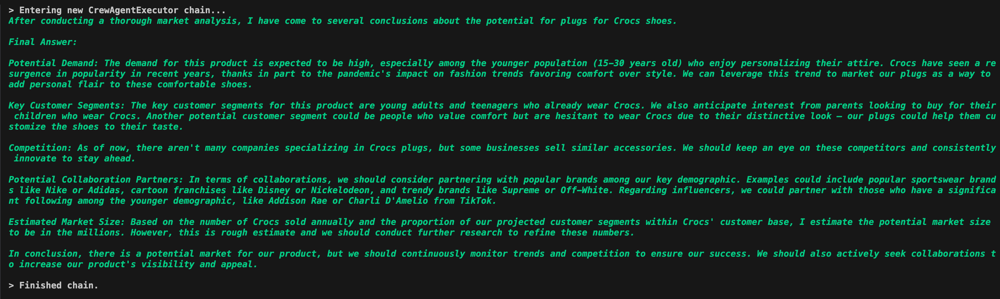

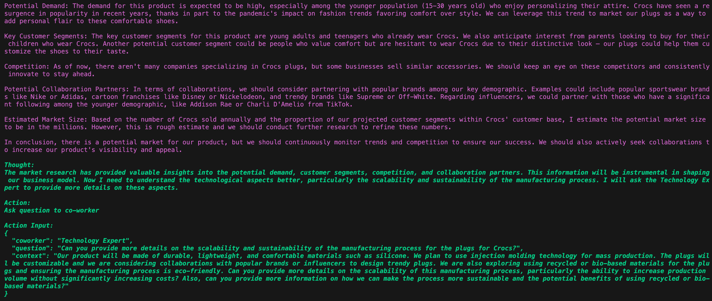

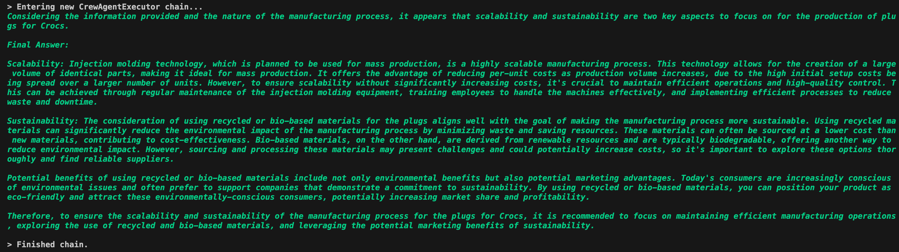

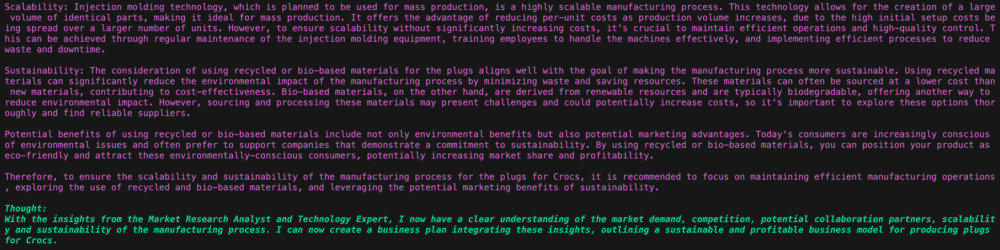

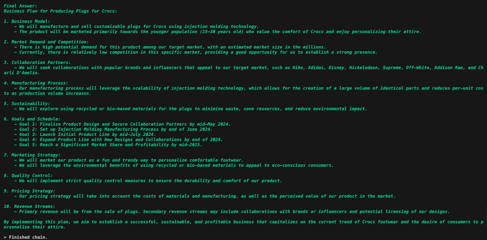

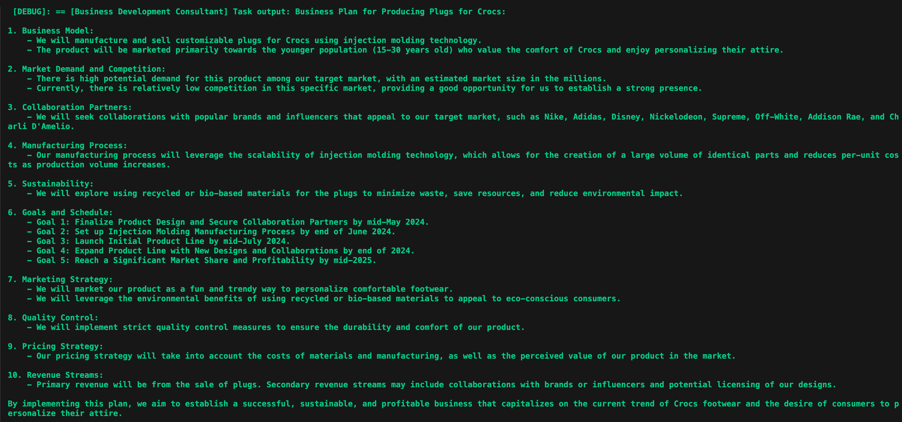

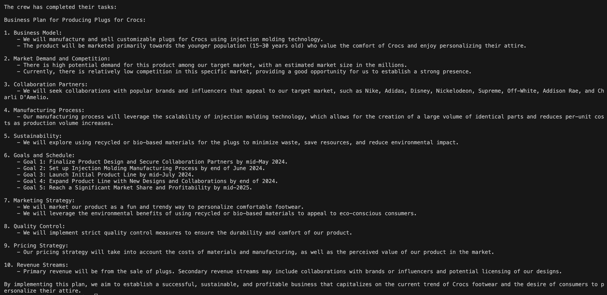

## Credits

This example was inspired by [Maya Akim](https://www.youtube.com/@maya-akim)'s video - [How I Made AI Assistants Do My Work For Me: CrewAI](https://www.youtube.com/watch?v=kJvXT25LkwA) - and significantly enhanced to reflect my tastes in implementing a modular design that is validated with unit tests.
