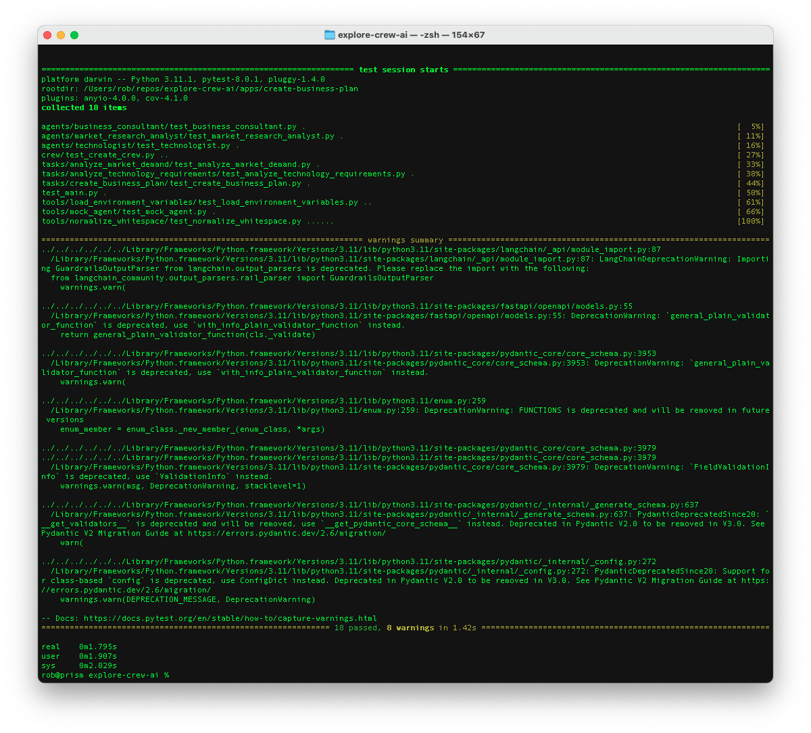
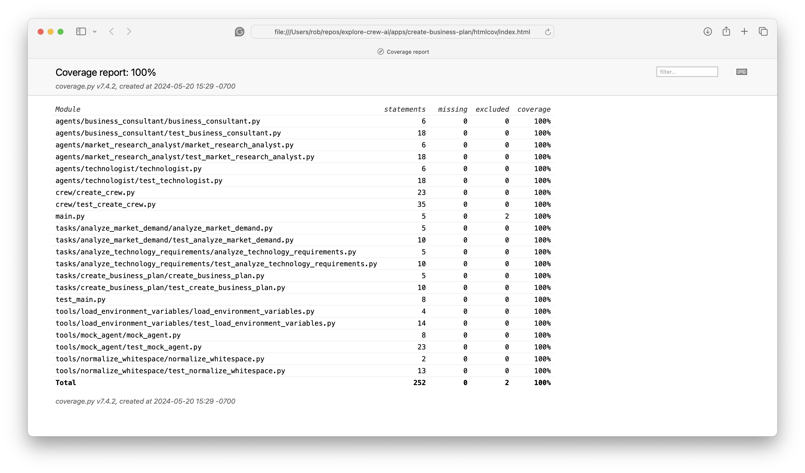

# Welcome

**DISCLAIMER: This code is provided as-is. While I have made an effort to prevent against unexpected billing of external APIs (including mocking external API calls in unit tests), by running this code you agree to not hold the author liable for any charges or costs incurred.**

This example uses CrewAI to orchestrate three agents - a business consultant, a market research analyst, and a technologist - to work together on evaluating an idea for a startup company and generating a business plan.

Here is a [demo](https://www.youtube.com/watch?v=qhHwLD01jXk) of the CrewAI agents in action - which took just under five minutes to complete in this example:

<iframe width="560" height="315" src="https://www.youtube.com/embed/qhHwLD01jXk" frameborder="0" allow="accelerometer; autoplay; clipboard-write; encrypted-media; gyroscope; picture-in-picture" allowfullscreen></iframe>

## TL;DR

If you want to dive right in and run the code, all you need to do is:

- Create an OpenAI API key to bill usage to your account
- Copy `.env.sample` to `.env` so you can supply a valid OpenAI API key and any other desired environment variables.

Assuming you have Python installed on your development machine, you can run the following from the root directory of this repo:

- `./manage.sh test` - VERIFY all tests pass to ensure your code is ready to run as designed

- `./manage.sh test --coverage` - OPTIONAL: Run the unit tests and generate a code coverage report

- `time ./manage.sh start` - This will take several minutes to run, so I recommend using the `time` command if available to see how long it takes.

## What's in this example?

### Tests

I have written tests using [pytest](https://docs.pytest.org/) to validate the code functions as designed.

Unit tests have been written to mock calls to external LLMs (such as OpenAI) so that you are not interacting with and getting billed for live API calls.

Having said that, please review the tests before running this code to ensure that you are not unexpectedly hitting the live OpenAI endpoints and incurring charges for running unit tests.

### Project structure

At a high level, we are using CrewAI to:

- Assemble a crew of three agents to collaborate and work towards achieving a specific goal (a business plan for a proposed product)

.
├── README.md
├── **screenshots**
│   └── Images for this README
├── agents
│   ├── business_consultant
│   │   ├── business_consultant.py
│   │   └── test_business_consultant.py
│   ├── market_research_analyst
│   │   ├── market_research_analyst.py
│   │   └── test_market_research_analyst.py
│   └── technologist
│       ├── technologist.py
│       └── test_technologist.py
├── crew
│   ├── create_crew.py
│   └── test_create_crew.py
├── main.py
├── requirements.txt
├── tasks
│   ├── analyze_market_demand
│   │   ├── analyze_market_demand.py
│   │   └── test_analyze_market_demand.py
│   ├── analyze_technology_requirements
│   │   ├── analyze_technology_requirements.py
│   │   └── test_analyze_technology_requirements.py
│   └── create_business_plan
│       ├── create_business_plan.py
│       └── test_create_business_plan.py
├── test_main.py
└── tools
    ├── load_environment_variables
    │   ├── load_environment_variables.py
    │   └── test_load_environment_variables.py
    ├── mock_agent
    │   ├── mock_agent.py
    │   └── test_mock_agent.py
    └── normalize_whitespace
        ├── normalize_whitespace.py
        └── test_normalize_whitespace.py

## Credits

This example was inspired by [Maya Akim](https://www.youtube.com/@maya-akim)'s video - [How I Made AI Assistants Do My Work For Me: CrewAI](https://www.youtube.com/watch?v=kJvXT25LkwA) - and significantly enhanced to reflect my tastes in implementing a modular design that is validated with unit tests.
