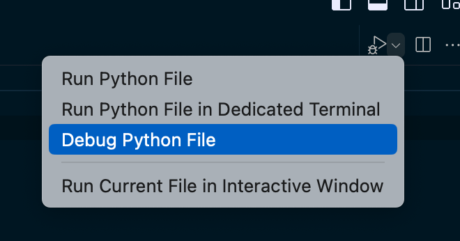
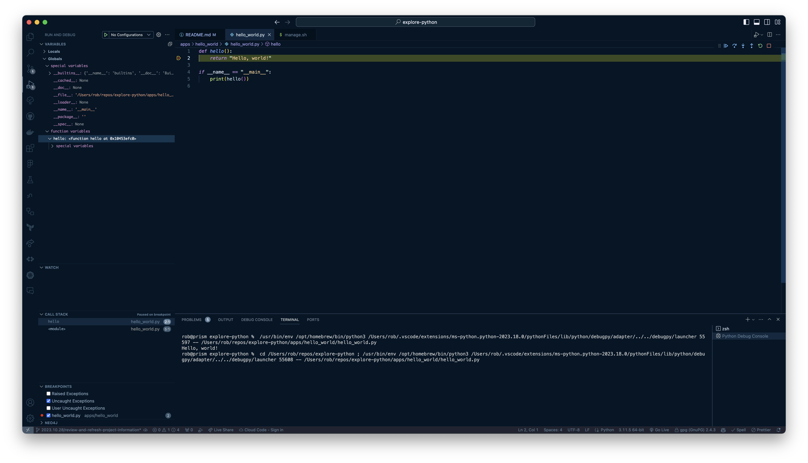
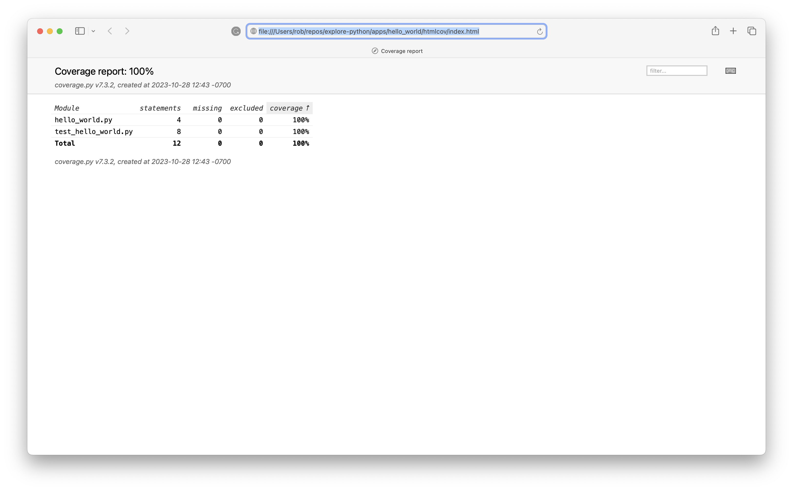
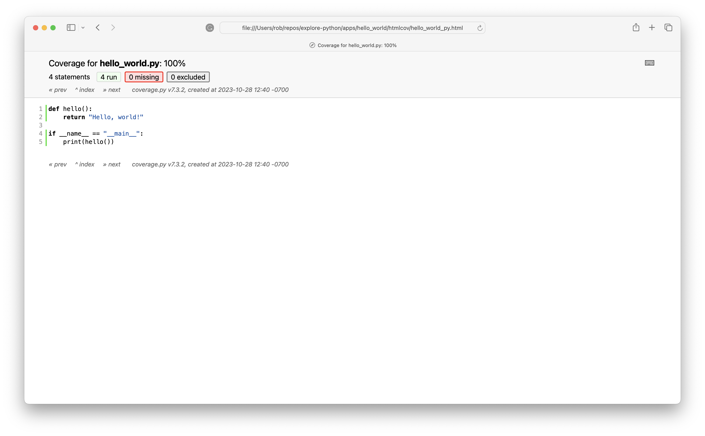
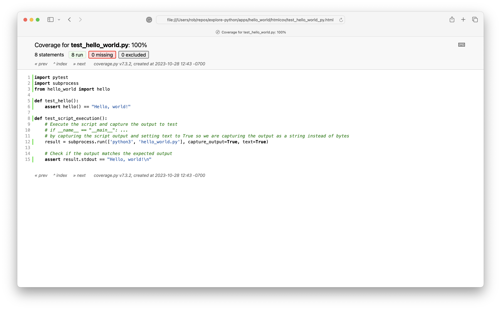

# Welcome

What project starter would be complete without an obligatory "Hello, world!" example? 🤓

This project also includes having an ability to debug code using VS Code - and example unit tests to get you started:

